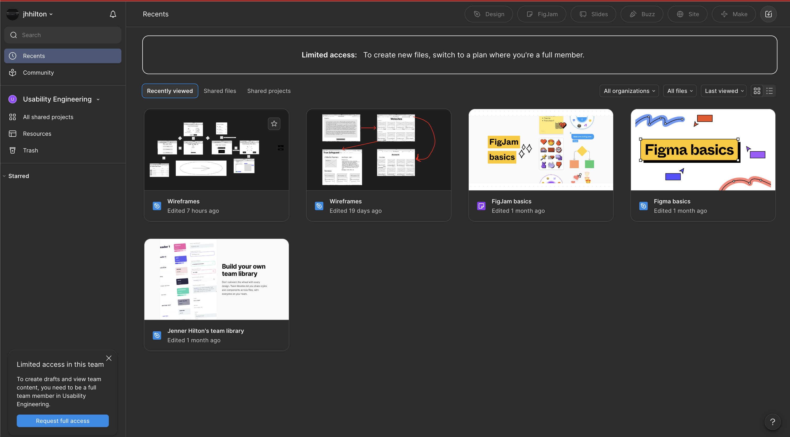
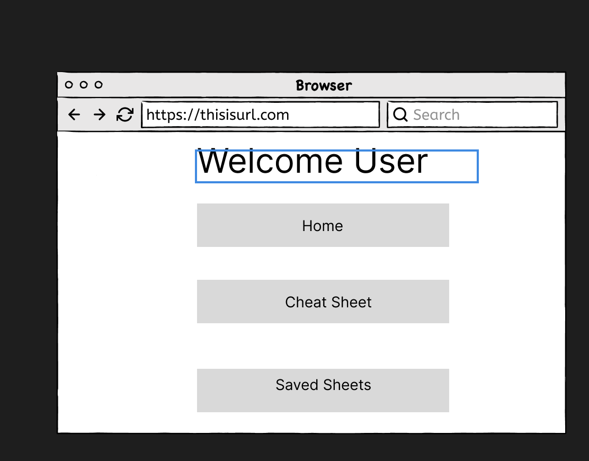
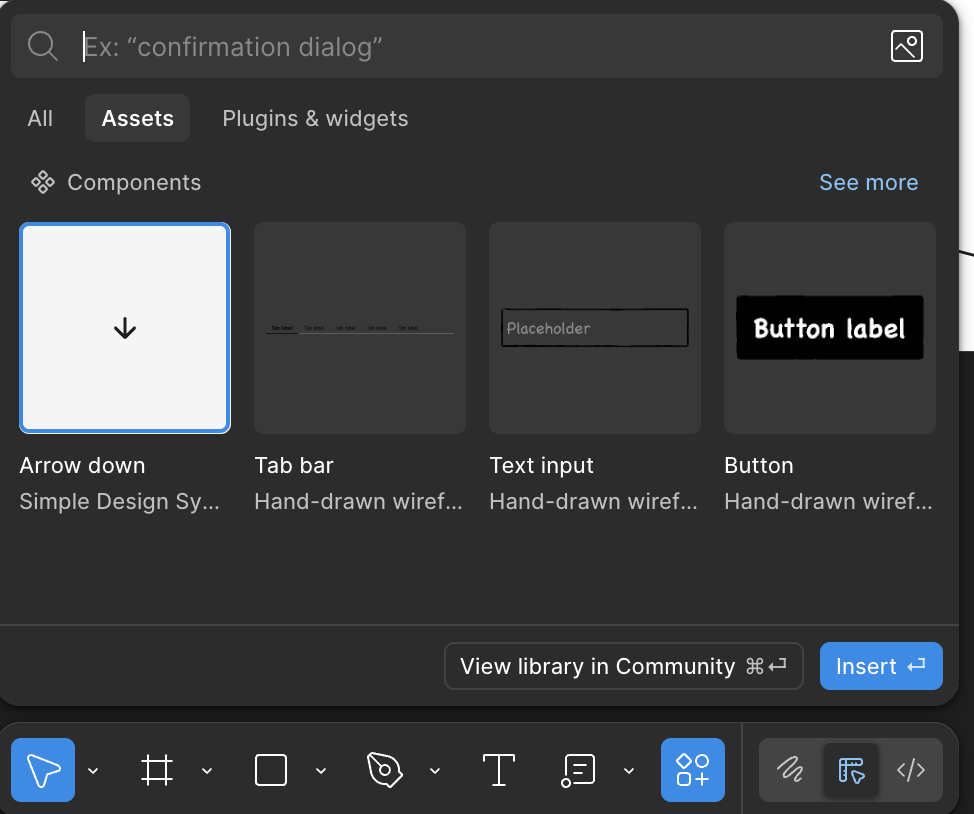

Over this semester I have been learning about the good, the bad, and the ugly of UX. After seeing some of the abominations of examples I was questioning what I would write my journal about. Then it came knocking on my door, Figma.  
Figma has it all good and bad. To quickly cover the process, users must make an account with Figma to make documents and projects but this process is standard, nothing special or bad with it. Moving on to the home page. If you are signed in on an account that isn't a full account like mine you will have access to files and projects that are shared with you. This page has really good **Natural Mapping**. What you see is what you get so you can see all the projects you are involved in and opening those projects is as easy as clicking on the project. This also matches my **Conceptual Model** where opening a project should be I can see it I can access it. Now moving on to actually building projects in Figma is a different story.  
  
Time for the bad, now actually making the projects is another story of frustration and unclear instructions which stop users dead in their tracks. One of the biggest issues I had to deal with was my **Mental Model** not lining up with the actual model. When I wanted to add text I would add the text then start trying to type. What would actually happen? It would add the text bubble but then it would start cycling through the keyboard shortcuts. What I really would have to do was edit the text and first choose a font. When it first does this it is intimidating because it indicates it can change all the font to the font you choose and if you don’t know what font is the font your using it will intimidate you from making a decision. Now all you really need to do is just click confirm and not choose a font and it will use the font already used giving the user the ability to edit the text.  
  
	When it comes to building out your projects there is an assets tab that lets you import arrows and templates. This is good because it's easy to use matching my **Mental Model** of clicking and pasting the template. You can also select all the assets to either enlarge or shrink it to make it the necessary size the user needs. This allows for easy formatting of premade assets. The only issue is that then editing those assets is a pain that is nowhere nearly as straight forward as the formatting process.   
  
	Overall I give Figma a 5/10 because while it is useful it is a pain to wrangle it under control.

